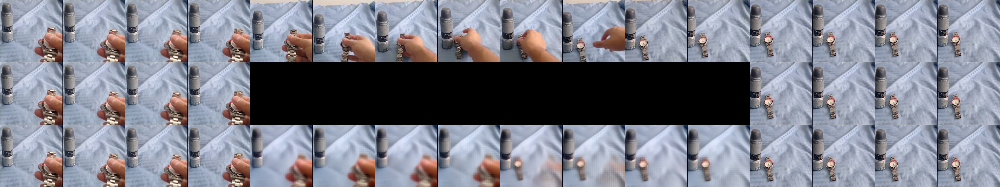
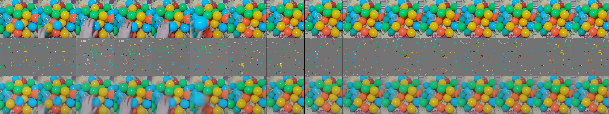

# HVM-1: Video models trained on ~5k hours of human-like video data

These models were pretrained with the spatiotemporal MAE algorithm on ~5k hours of curated human-like video data (mostly egocentric, temporally extended, continuous video recordings) and then, optionally, finetuned on various downstream tasks with few-shot supervised training.

## What you need
Please see the automatically generated [`requirements.txt`](https://github.com/eminorhan/hvm-1/blob/master/requirements.txt) file specifying the environment under which the code was tested. A few notes:
* The model implementatations use FlashAttention-2, so you will need `pytorch>=2.2`.
* You will need the `av` library only for visualizing the model completions (as described below).

## Loading the models
Model names are specified in the format `x_y_z`, where `x` is the model type, `y` is the pretraining data the model is trained with, and `z` is the finetuning data the model is finetuned with (if any). All models have a ViT-H/14 backbone.

* `x` can be one of `mae`, `vit`
* `y` can be one of `hvm1`, `hvm1@448`
* `z` can be one of `none`, `ssv2-10shot`, `ssv2-50shot`, `kinetics-10shot`, `kinetics-50shot`, `imagenet-2pt`

Loading a pretrained model is then as easy as:

```python
from utils import load_model

model = load_model('vit_hvm1@448_none')
```

This will download the corresponding pretrained checkpoint, store it in cache, build the right model architecture, and load the pretrained weights onto the model, all in one go.

### Explanations
**Model types (`x`):**
* `mae` will instantiate a spatiotemporal MAE architecture (with an encoder and a decoder).
* `vit` will instantiate a standard spatiotemporal ViT-H/14 architecture. 

If you'd like to continue training the pretrained models on some new data with the spatiotemporal MAE objective or if you'd like to analyze the pretrained MAE models (for example, analyze their video interpolation capabilities), you should use the `mae` option. If you'd like to finetune the model on a standard downstream video/image recognition task, or something similar, you should choose the `vit` option instead.

**Pretraining data (`y`):** 
* `hvm1`: pretrained with the full ~5k-hour human-like video dataset at 224x224 resolution. 
* `hvm1@448`: pretrained with the full ~5k-hour human-like video dataset at 448x448 resolution.

The models were all pretrained with the spatiotemporal MAE objective using code from [this repository](https://github.com/eminorhan/mae_st). The SLURM batch scripts used for training all models can be found [here](https://github.com/eminorhan/mae_st/tree/master/scripts). 

**Finetuning data (`z`):** 
* `none`: no finetuning (you will need to use this option if you choose the `mae` option for `x`).
* `ssv2-10shot`: finetuned with the 10-shot SSV2 task.
* `ssv2-50shot`: finetuned with the 50-shot SSV2 task.
* `kinetics-10shot`: finetuned with the 10-shot Kinetics-700 task. 
* `kinetics-50shot`: finetuned with the 50-shot Kinetics-700 task.
* `imagenet-2pt`: finetuned with 2% of the ImageNet training data.

The models were again all finetuned with code from [this repository](https://github.com/eminorhan/mae_st). The SLURM batch scripts used for finetuning all models can be found [here](https://github.com/eminorhan/mae_st/tree/master/scripts/finetune).

You can see a full list of all available models by running:
```python
>>> print(utils.get_available_models())
```

You will get an error if you try to load an unavailable model.

## Visualizing the model completions
In [`visualize_completion.py`](https://github.com/eminorhan/hvm-1/blob/master/visualize_completion.py), I provide sample code to visualize model completions from pretrained spatiotemporal MAE models. An example usage would be as follows:
```python
python -u visualize_completion.py \
        --model_name 'mae_hvm1@448_none' \
        --img_size 448 \        
        --mask_ratio 0.5 \
        --mask_type 'center' \
        --video_dir 'demo_videos' \
        --num_vids 16 \
        --device 'cuda'
```
This will randomly sample `num_vids` videos from `video_dir` and visualize the model completions together with the original sequence of frames and the masked frames. Currently, three types of masking strategies are supported: `random` (random spatiotemporal masking as in pretraining), `temporal` (masking out the final portion of the sequence), and `center` (masking out the middle part of the sequence, as described in the paper). Running the code with these masking strategies will produce images like the following, where the top row is the original sequence, the middle row is the masked sequence, and the bottom row is the model completion:

**`center`:**


**`random`:**


**`temporal`:**


Further examples can be found in the [comps](https://github.com/eminorhan/hvm-1/tree/master/comps) folder.
